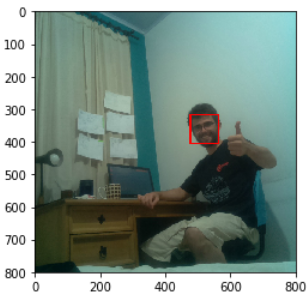
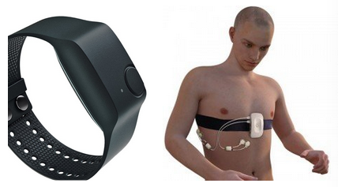

# Project description

This project is a team effort for NASA's hackaton (A World Away section) to identify pandemic social problems that may have collateral effects in remote locations (such as space). How will you prepare for the collateral effects in remote locations, and/or evaluate on-Earth support and remote location risks, including psychological and technical risks?
https://covid19.spaceappschallenge.org/challenges/covid-challenges/world-away/teams/gagarin/project

# Video acquisition and embedded prototype

Objective: a device that could capture image data, do some basic processing, and transmit this data to a central station

We chose a Raspberry Pi Zero W as edge computing device, because it already have built in wifi and because its processing power is good enough to perform basic images transformations.

We used a 5 megapixel camera based on the technology CMOS, with connection CSI (Camera Serial Interface). Its FOV (Field of View) is 65 degrees and its resolution is 2592x1944, therefore being suitable for our application.

We developed an initial prototype using a prototyping board, connecting the raspberry pi with the camera, the sensor BME280 (temperature, pressure and humidity) and a LCD display for local interface.

After validation, we put just the raspberry and the camera inside a metallic case for protection:

After capturing the image, the raspberry perform Face Recognition to identify where in the picture are the people. We chose a [Cascade Classifier](https://www.researchgate.net/publication/3940582_Rapid_Object_Detection_using_a_Boosted_Cascade_of_Simple_Features) to perform this task, because it is lightweight and fast to implement. 

This image is then cropped and, in the future, we’ll send this crop to the Jarvis local server. We crop the image in order to reduce the data traffic through the network.

If we have more time, we would use a more powerful hardware to perform this task (example: Nvidia Jetson, shown below) in order to perform more insightful analysis before send the data to the local server and explore the full possibilities of Internet of Things, Edge Computer, and Embedded Computer Vision.

# Local server video processing

We did not implement the full communication between edge device and local server, so we are transmitting the data manually (using scp, secure copy) and analysing on-request. This workload can be completely automated, for example: 

1. The raspberry establish a TCP socket communication with a Flask Webserver running on Jarvis’ central computer
2. The web server manages this data following the best practices of operational databases, data lakes and data warehouses

The first image analysis performed is the identification of the faces landmarks using [MTCNN](https://arxiv.org/abs/1604.02878) (Multi-task Cascaded Convolutional Neural Networks) architecture, chosen because it’s well known and well tested. The face emotion recognition is performed using the [VGG16](https://arxiv.org/abs/1409.1556) architecture trained on [FER13 dataset](https://datarepository.wolframcloud.com/resources/FER-2013), which classifies the face into one of the following emotions: angry, scared, happy, sad, surprised, or neutral.

The second analysis performed is called **Instance Segmentation**, which identify: what objects are present in the scene, where they are, and which pixels belong to each one of them. We are using the [RCNN architecture](https://arxiv.org/abs/1311.2524), a well known neural network to this type of task, trained on the [MSCOCO dataset](https://arxiv.org/abs/1405.0312). With this “mask” representation we can calculate the following features:

* How far two persons are
* If they are touching
* What objects the person is using

If we had more time, we’ll analyse the following high level indicators:

* What is the person’s posture, shape of the body, join angle, etc
* Body dynamics: gait, how she moves, how coordinated she is, etc

# Wearable data collection device

We’ll use the Chest-worn device [RespiBAN](https://www.biosignalsplux.com/index.php/respiban-professional) and the Wrist-worn device[ Empatica E4](https://www.empatica.com/research/e4/) to collect biometric data from every crew member:

With this two devices, we’ll be able to measure: blood volume pulse, electrocardiogram, electrodermal activity, electromyogram, respiration, body temperature, and three-axis acceleration.

To validate this idea, we are using the WESAD dataset (Wearable Stress and Affect Detection), which provides raw time series data using the two aforemetioned devices alongside physical and psychological questionnaire to each participant of the experiment. This dataset was developed by Philip Schmidt, Attila Reiss, Robert Duerichen, Claus Marberger and Kristof Van Laerhoven in [2018](https://dl.acm.org/doi/10.1145/3242969.3242985), and its pubicly available in [University of Californa Machine Learning Repository](https://archive.ics.uci.edu/ml/datasets/WESAD+(Wearable+Stress+and+Affect+Detection)).

We selected three subjects from this dataset, and are visualizing some of the variables in our integrated dashboard:

If we had more time we would develop our own data acquisition hardware, tailoring for our needs what is measured and how the signal is filtered. 

If we had more time we would also improve the data processing, taking into consideration biomedical considerations and extracting useful indicators from the raw time series. For instance: the heartbeat can be measured using the raw signal from the photoplethysmograph, but just the raw signal does not provide any useful information. Each sensor data should be processed in its own way, but we did not had the time to do it.

# Psychological mental health

We’ll assess the mental health of the person using their written and recorded reports, using Natural Language Processing techniques, and also using standard psychological test that can be performed in a remote environment.

To validate this idea, we are using the [Performance Readiness Evaluation Tool (PRET)](ftp://ftp.asc-csa.gc.ca/users/OpenData_DonneesOuvertes/pub/PRET/) from Canadian Space Agency, which perform a several psychological tests in order to improve the capability to monitor and evaluate the neurocognitive status of astronauts aboard the International Space Station. 

We selected some subjects from this dataset and we are visualizing some of the variables in our integrated dashboard:

If we had more time we would integrate into our system the analysis of emotion using speech, using the dataset [The Ryerson Audio-Visual Database of Emotional Speech and Song (RAVDESS)](https://zenodo.org/record/1188976#.XtQlEBZ7k8o)*.* We would also perform Sentiment Analysis based on the written reports (or speech-to-text transcriptions), for instance using the [Stanford University open tool for Sentiment Analysis](http://nlp.stanford.edu:8080/sentiment/rntnDemo.html) or training our own Natural Language Processing like the paper [Sentiment Analysis for Airlines Services Based on Twitter Dataset](https://www.researchgate.net/publication/329093639_Sentiment_Analysis_for_Airlines_Services_Based_on_Twitter_Dataset).

Integrating these three 

# Psychological mental health - Other datasets

The aforementioned dataset (from Canadian Space Agency) was the only non-summarized data we were able to find in order to assess mental health. However, there are plenty of literature analysing the relations between human performance, stress, and psychic health, for instance:

Paper[ Teams in Space Exploration: A New Frontier for the Science of Team Effectiveness](https://journals.sagepub.com/doi/abs/10.1177/0963721414566448): provides insightful analysis on situations like the future Mars exploration that “[...] will require a team of crew members who will have to endure and sustain team performance requirements never seen before” 

The book “[Psychology of Space Exploration: Contemporary Research in Historical Perspective](https://www.researchgate.net/publication/319979791_Psychology_of_space_exploration_Contemporary_research_in_historical_perspective)” motivated us to analyse facial emotion when stating that *“Minimally intrusive techniques are particularly useful, and one of these is based on nonintrusive computer monitoring of facial expression. Another approach is monitoring cognitive functioning through computer analysis of speech. Encouraging astronauts to monitor their own behavior reduces the threat that performance lapses could lead to flight disqualification. This self-monitoring has been accomplished by means of computers and personal digital assistants (PDAs) that are programmed to measure several dimensions of cognitive functioning (attention, information processing, and recall). Astronauts may use the results of these tests to gauge their own preparedness to engage in a particular activity”* (pg. 45)

 

[Fatigue scores comparisson](https://lsda.jsc.nasa.gov/Dataset/dataset_detail_result/J0001209) (Nasa lsda): analysis Visual Analogue Scale (VAS), Profile of Mood States (POMS) and Arousal Score

Nasa’s experiment [Developing, Maintaining, and Restoring Team Cohesion](https://lsda.jsc.nasa.gov/Experiment/exper/1657) resulted in several publications. One of them stated that “The new measurement tools promise to be less obtrusive. Video and wearable sensors do not intrude and interfere with an ongoing stream of behavior” ([Kozlowski et al., 2016, pg 302](https://psycnet.apa.org/record/2015-54537-010)) provided us with key motivation to use the chosen technologies. 

Our project also aims to address the sleep and nutricion of the crew. As shown in Nasa’s report [Risk of Performance Decrements and Adverse Health Outcomes Resulting from Sleep Loss, Circadian Desynchronization, and Work Overload](https://humanresearchroadmap.nasa.gov/Evidence/reports/Sleep.pdf), “Spaceflight evidence demonstrates that astronauts experience sleep loss, circadian desynchrony, and work overload consistent to a degree that is associated with significant performance impairment in ground-based studies” (pg 59)

[**Mood and Social Climate Significant Main Effect Results for Crew Only**](https://lsda.jsc.nasa.gov/Dataset/dataset_detail_result/96_E096__2710252773) (Nasa lsda)**:** analysis Tension-Anxiety, Leader Support, Task Orientation, Anger and Aggression, Order and Organization, Leader Control, Innovation, Work Pressure

[Sociokinetic Analysis as a Tool for Optimization of Environmental Design](https://lsda.jsc.nasa.gov/Dataset/dataset_detail_result/JMGROUNDLMLSTP37_117) (Nasa lsda): Room Usage Difference Within Each Week:   

[Development and Validation of a Tool to Predict, Evaluate, and Mitigate Excessive Workload Effects](https://humanresearchroadmap.nasa.gov/tasks/task.aspx?i=611) (Nasa HRR)

 

[Work Pressure Among ISS and Mir Crewmembers](https://lsda.jsc.nasa.gov/Dataset/dataset_detail_result/96_E096__2721238278) (Nasa lsda): compares work pressures in Americans and Russians on the ISS??

Stanford’s paper [Psychological Stress Associated with the COVID-19 Crisis](https://www.nlm.nih.gov/dr2/Psychological_Stress_Associated_with_the_COVID-19_Crisis_14.pdf)

Nasa’s article [Conquering the Challenge of Isolation in Space: NASA’s Human Research Program Director Receives National Recognition](https://www.nasa.gov/feature/conquering-the-challenge-of-isolation-in-space-nasa-s-human-research-program-director)

